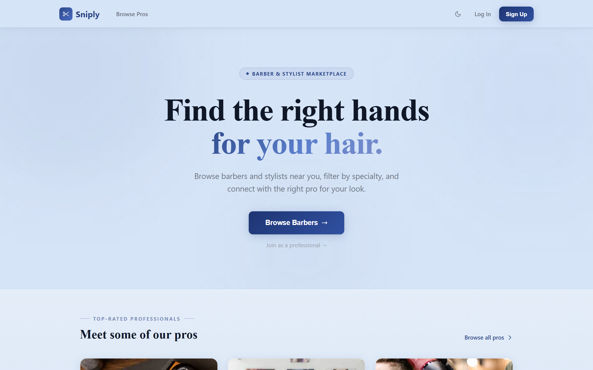
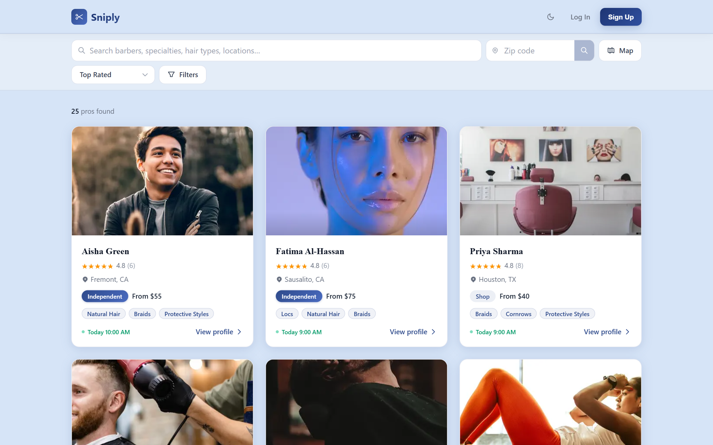
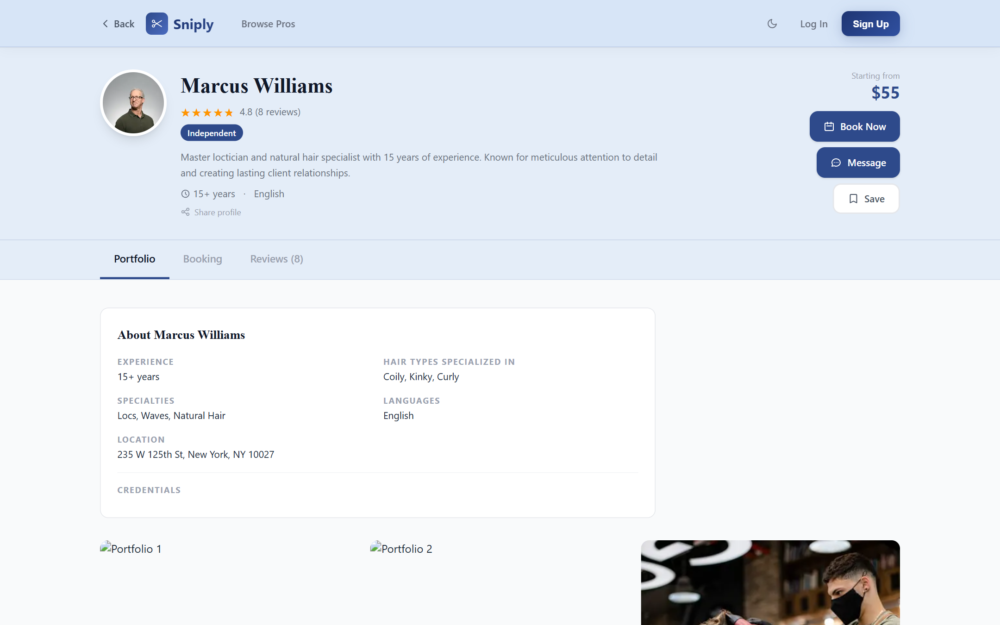

# sniply.biz

**A live two-sided marketplace for booking barbers and stylists.** Customers
discover pros by map, specialty, and availability, message them, and book in real
time; professionals run their book, services, hours, and profile from a dashboard.
The unglamorous parts are the point: real auth, race-condition-safe booking, and a
test suite that covers both sides.

### ▶ Live at [sniply.biz](https://sniply.biz)



| Map + specialty discovery | A pro's profile & booking |
|---|---|
|  |  |

<sub>Customers browse and filter pros (map, hair type, specialty, availability),
then open a profile to review portfolio, reviews, and book a slot. Shown with the
seeded demo professionals.</sub>

## Features

- **Discovery** — location-based search with an interactive Leaflet map, filtered by hair type, specialty, and availability.
- **Matching** — smart scoring surfaces the best-fit professionals first.
- **Booking** — real-time availability, PostgreSQL advisory locks prevent double-booking across instances.
- **Messaging** — in-app chat between customer and professional.
- **Reviews and scheduling** — post-appointment reviews, calendar view for professionals.
- **Auth** — custom HMAC-SHA256 session tokens with timing-safe verification, role-based access (customer vs pro).

## Architecture

Monolithic Next.js 16 full-stack. Pages and API routes colocated under `app/`, shared data access and auth under `lib/`.

```
app/
  (customer)/   customer-facing pages
  (pro)/        professional-facing pages
  api/          REST endpoints (auth, bookings, messages, etc)
lib/
  db/           typed Postgres query helpers, connection pooling (singleton Pool)
  auth/         HMAC-SHA256 sessions, role checks
  api/          typed async fetch wrappers with standardized error handling
types/          shared client/server type definitions
tests/          Vitest unit, API, and Playwright E2E
```

## Key patterns

- **PostgreSQL advisory locks** around the booking transaction prevent double-booking when two customers race to book the same slot across separate instances. Locks are keyed by `(professional_id, slot_start)`.
- **Custom session auth.** HMAC-SHA256 signed tokens with timing-safe verification. Sessions are stored server-side, clients hold only the signed token. Role-based access gates customer vs pro endpoints.
- **Typed data access.** Query helpers wrap the pg driver with generics so every DB call is typed end-to-end. Connection pooling via a singleton Pool.
- **Centralized fetch wrappers** on the client standardize error handling, JSON parsing, and retries.
- **Full test suite.** Vitest for unit and API tests, Playwright for 54 E2E tests covering auth, booking, messaging, and settings flows.

## Stack

Next.js 16 · React 19 · TypeScript · PostgreSQL (pg) · Tailwind CSS 4 · Vitest · Playwright · Leaflet · Resend · bcryptjs

## Running locally

```bash
pnpm install
cp .env.local.example .env.local   # set DATABASE_URL, RESEND_API_KEY, etc.
pnpm dev                            # http://localhost:3000
```
